# 120W Blue Diode Laser Array

A high-power 120W blue (445 nm) laser built by combining multiple blue laser diode bars into a single collimated beam. The entire assembly — from the custom water-cooled copper heatsink to the beam-combining optics and aluminium mounts — was designed and machined from scratch. The combined beam is powerful enough to cut through wood, engrave metal, and ignite materials at a distance.

## How It Works

Individual blue laser diode bars (each typically 6–9W) are mounted side-by-side on a precision copper heatsink. Each diode emits a divergent, astigmatic beam which is first collimated by a fast-axis collimator (FAC) lens, then the beams from all diodes are stacked and combined using cylindrical optics or simply spatially combined at the focus point. The copper heatsink is water-cooled to handle the thermal load at full power. A custom aluminium clamping fixture presses the diode bars uniformly against the heatsink for good thermal contact.

## Build Details

- **Output power:** ~120W optical (450 nm wavelength — deep blue/violet)
- **Laser diodes:** Multiple 9W 445 nm multi-mode diode bars
- **Cooling:** Custom water-cooled copper heatsink with machined microchannels/serpentine path
- **Heatsink material:** Copper (CNC milled)
- **Mounts:** Custom CNC-machined aluminium clamping brackets
- **Driver:** Constant-current laser diode driver
- **Optics:** FAC collimator lenses, beam-combining arrangement

---

## Gallery

### Parts & Fabrication

| | |
|---|---|
| 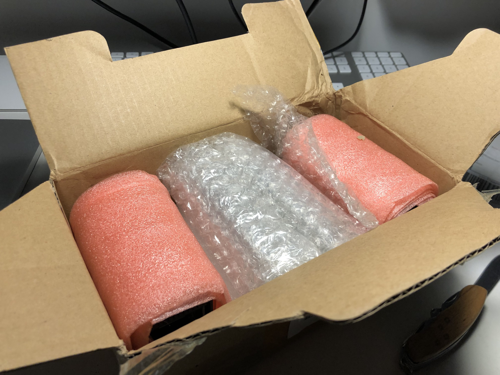 | 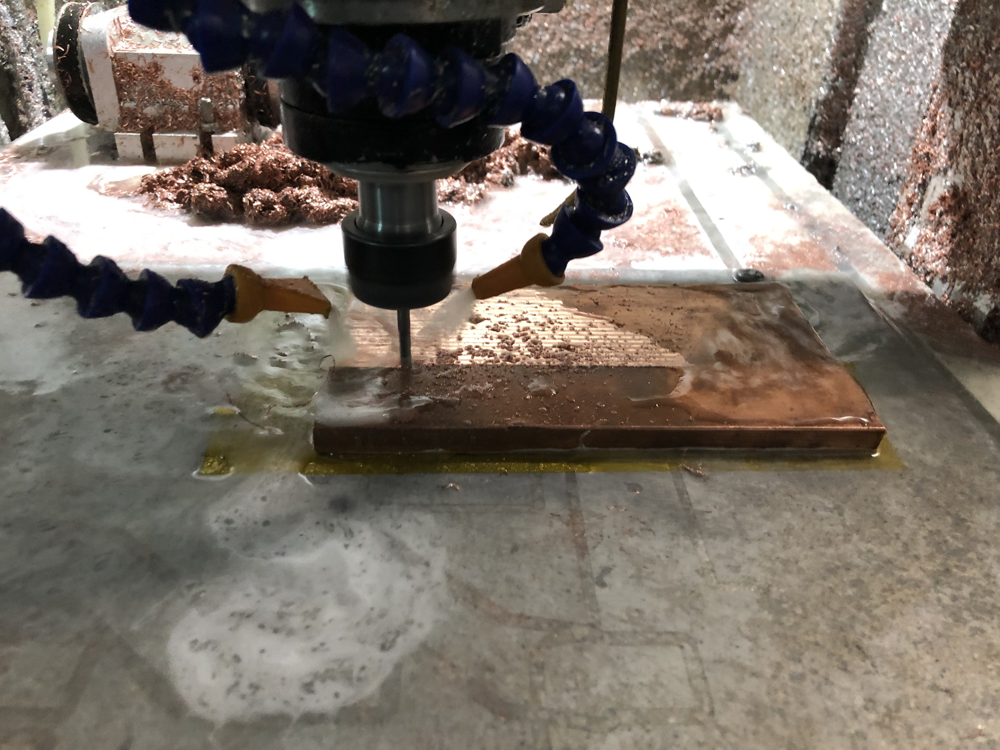 |
| **Laser diodes arriving** — the 445 nm laser diode bars packed in anti-static foam, fresh out of the shipping box. | **CNC milling the copper heatsink** — cutting the water-cooling channels into a thick copper plate on the CNC mill. Copper chips and coolant are visible. |

| | |
|---|---|
| 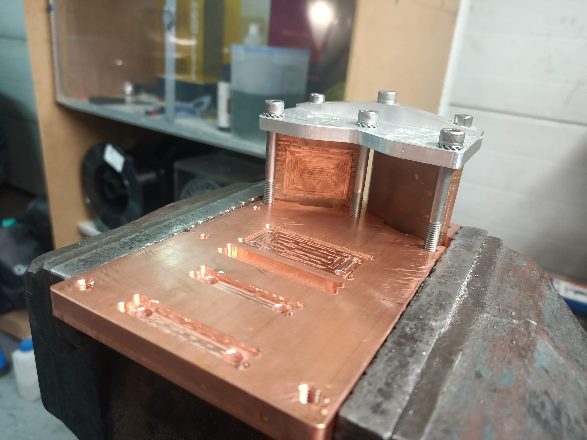 | 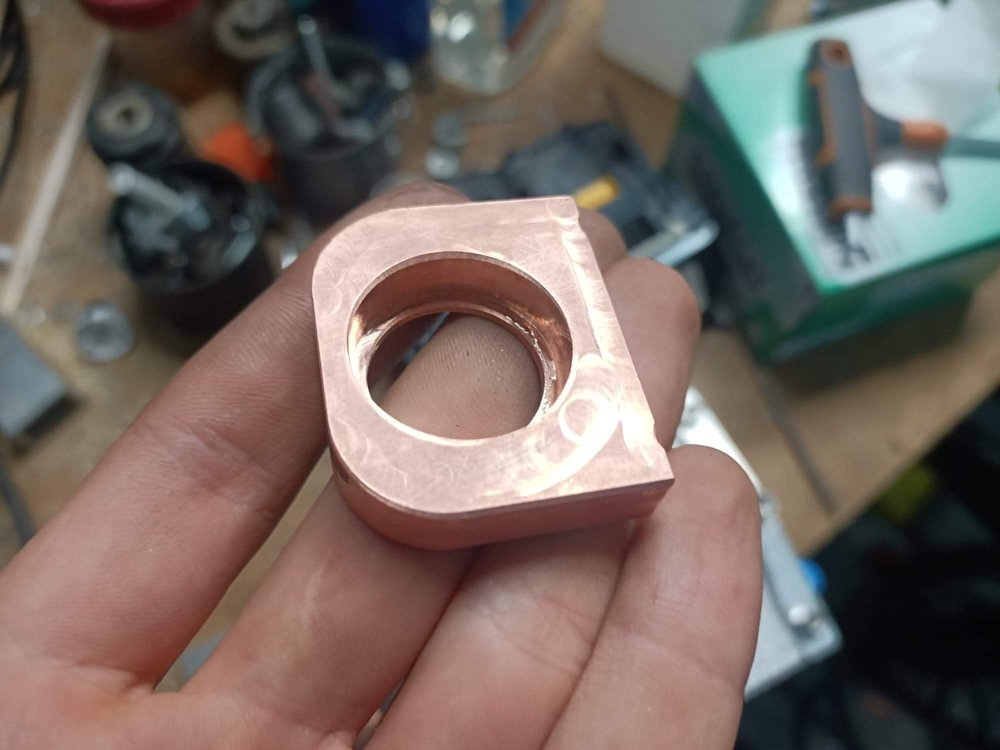 |
| **Machined copper heatsink assembly** — the finished water-cooled copper baseplate with the precision-milled slot for the diode array and a separate clamping bar held by threaded bolts. The serpentine microchannel pattern is visible on the base. | **Copper diode mount piece** — a hand-held close-up of one of the machined copper components used to clamp a single laser diode bar. The bore accommodates the diode body precisely. |

| | |
|---|---|
| 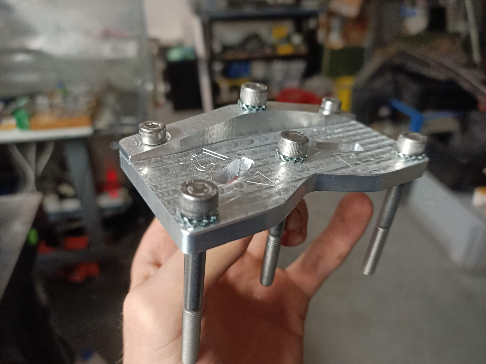 | 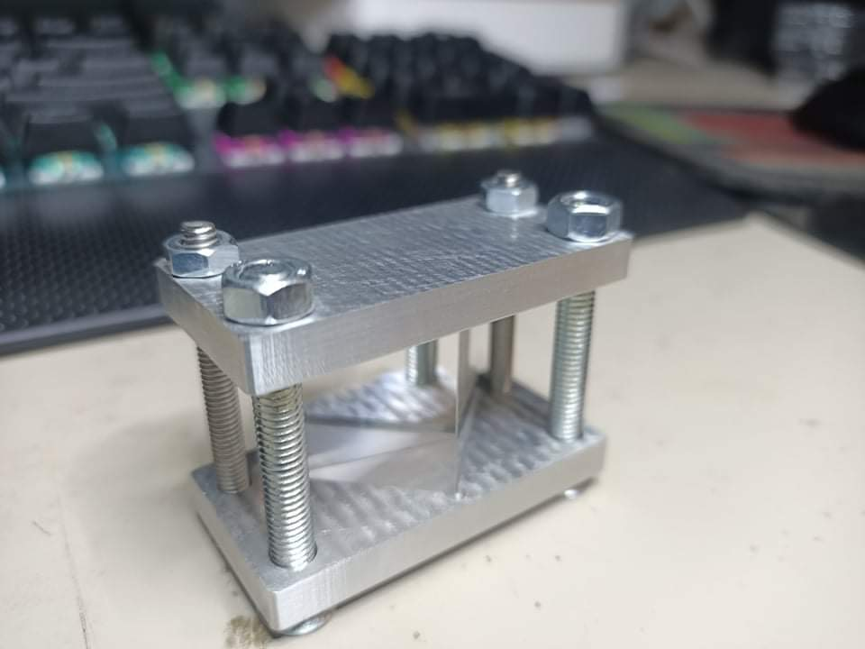 |
| **Machined aluminium mounting bracket** — a precision-drilled aluminium spacer/standoff used to align and secure the diode array sub-assembly, with captive adjustment screws. | **Finished aluminium diode clamp** — the completed two-plate aluminium clamping fixture assembled with threaded rods and locking nuts. This presses the diode bars uniformly against the copper heatsink. |

### Assembly & Operation

| | |
|---|---|
| 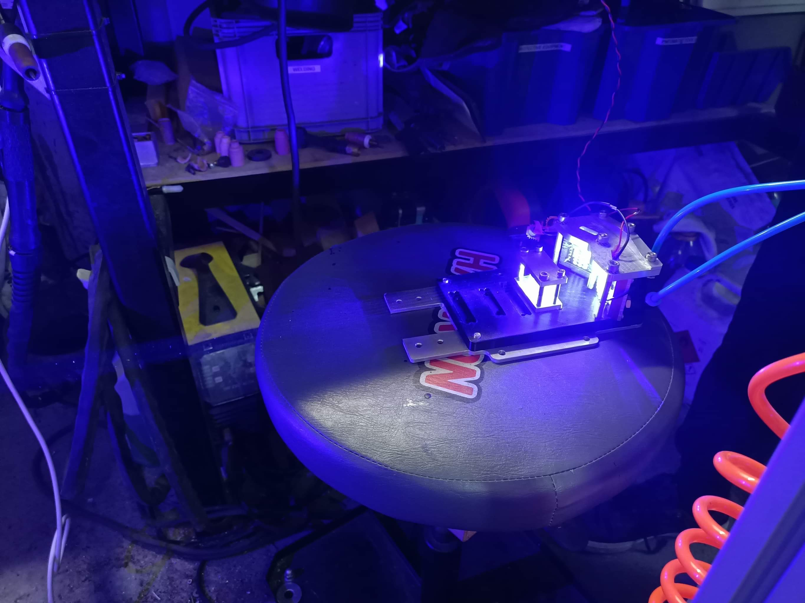 | 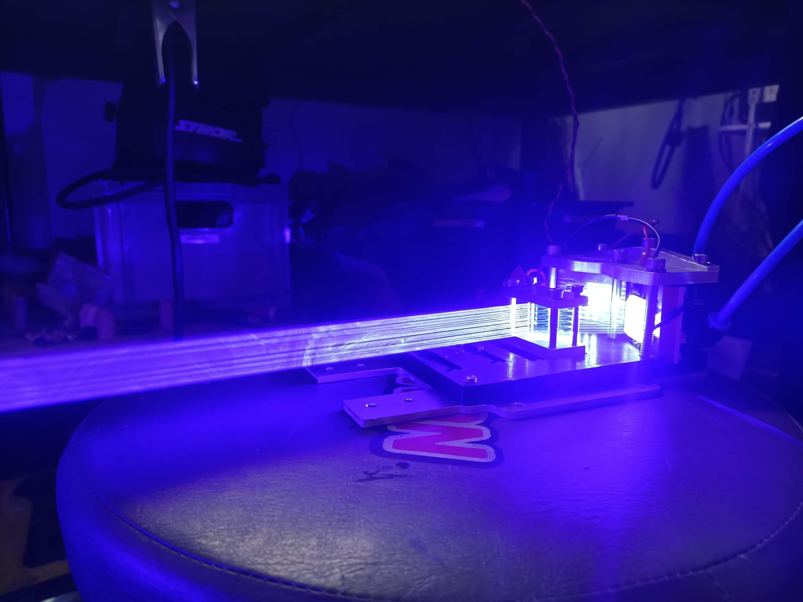 |
| **Assembled laser head firing** — the complete array on the workbench during a test fire. The intense blue glow saturates the camera sensor and the combined beam is visible even in the air due to scattering. | **Beam close-up** — looking along the beam axis from the side. The stacked array of individual diode beams is clearly visible as parallel lines before combining. |

| | |
|---|---|
| 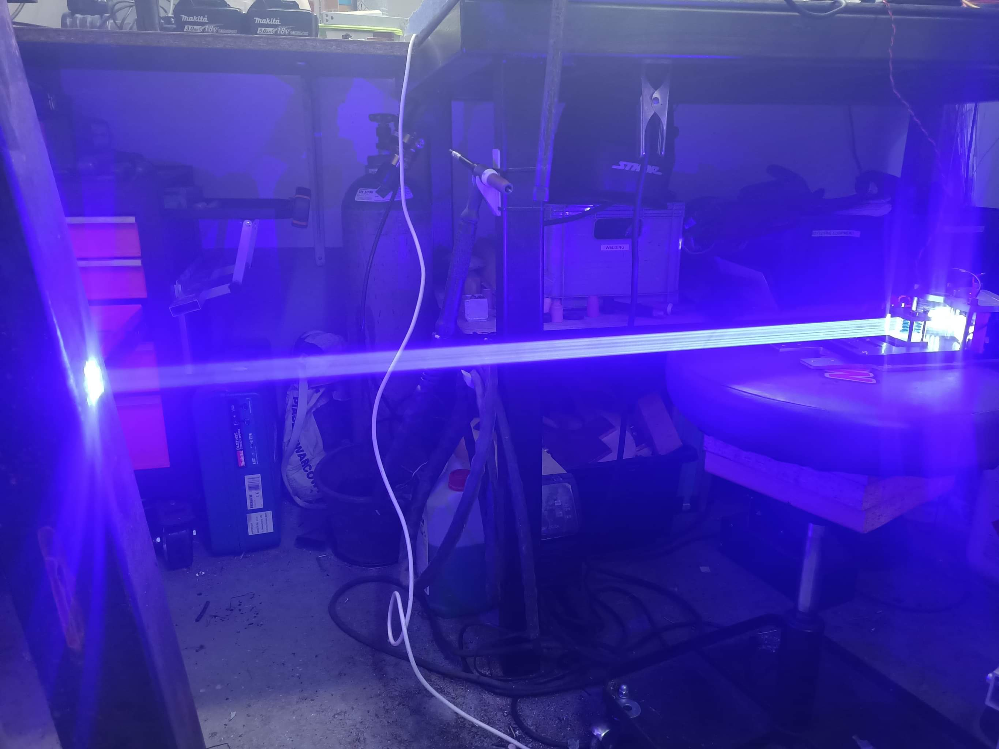 | 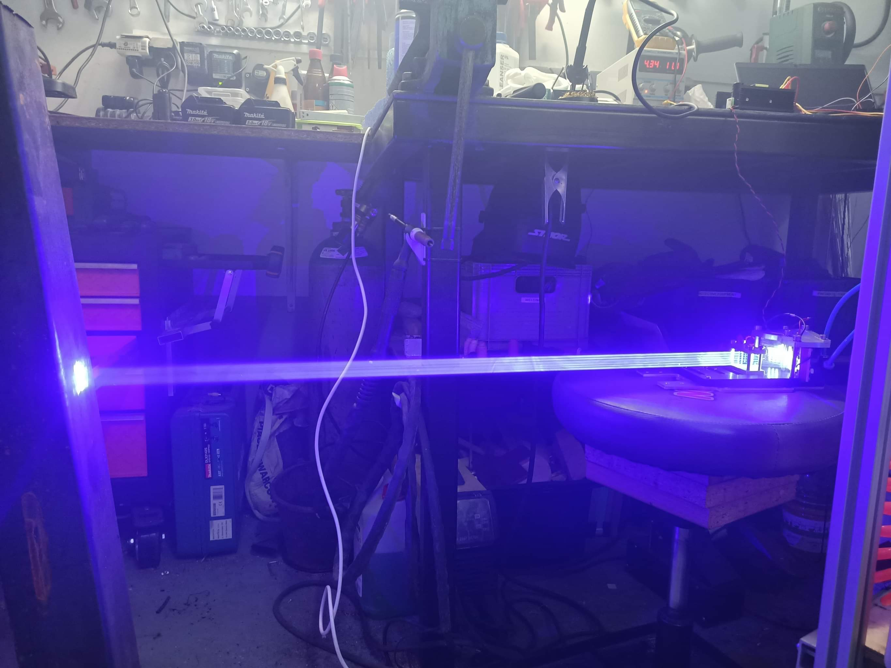 |
| **Full beam across the workshop** — at full power the beam stretches the full length of the workshop, illuminating dust particles in the air and casting a brilliant blue light across everything. | **Blue light flooding the workspace** — the room bathed in scattered 445 nm light during a full-power test, demonstrating the sheer output of the array. |

| |
|---|
| 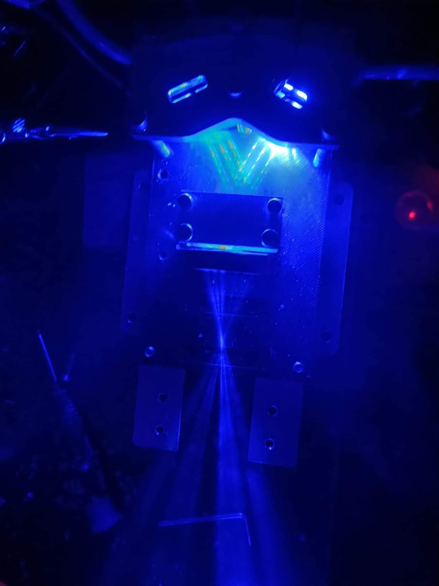 |
| **Beam-combining optics** — close-up of the laser head output stage, showing the converging beams from the individual diodes being directed downward through the combining optics. The green and yellow iridescence on the aluminium plate is from the intense blue light. |

---

## Videos

Several video recordings of the laser firing at various power levels are included in this folder.

---

## Safety Notes

> ⚠️ **Extreme laser hazard.** 120W of 445 nm light will cause instant, permanent blindness and can ignite materials at a distance. Appropriate OD 6+ laser safety goggles rated for 445 nm are required at all times during operation. Never fire without a beam stop and proper enclosure.
