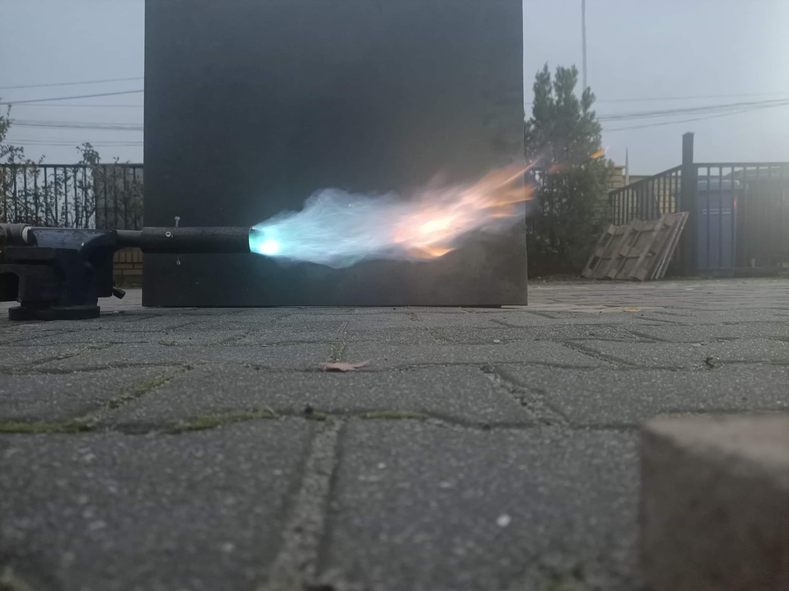

# DIY Gas Torch

A homemade high-output gas torch/burner, built from scratch. The torch produces a large, powerful flame suitable for metalworking applications such as brazing, annealing, and heat treatment. The design uses a custom nozzle body and a standard gas supply (propane or propane/oxygen mix).

## How It Works

The torch mixes fuel gas with air or oxidiser at a custom-machined nozzle, producing a wide, forceful flame. The nozzle geometry controls the flame shape and combustion characteristics. The resulting flame shows the characteristic blue inner cone of complete combustion surrounded by an orange diffusion flame where excess fuel burns in ambient air.

---

## Gallery

| | |
|---|---|
|  | |
| **Torch in action** — low-angle shot of the torch firing at full output. The brilliant blue inner flame and orange outer diffusion flame are clearly visible spreading across a steel plate. The raw power of the flame is evident even against the overcast outdoor background. | |

---

## Videos

Multiple video recordings of the torch firing at various settings are included in this folder, showing the flame character at different gas flow rates.

---

## Notes

- Always operate outdoors or in a well-ventilated space
- Keep a fire extinguisher nearby during testing
- Never leave an open flame unattended
