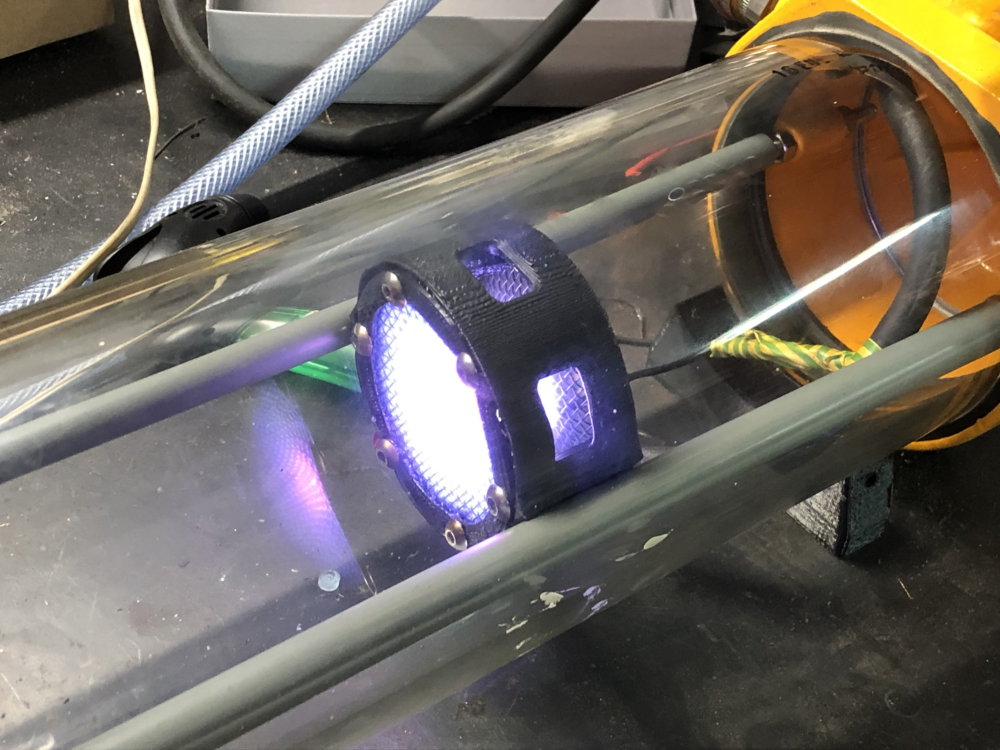
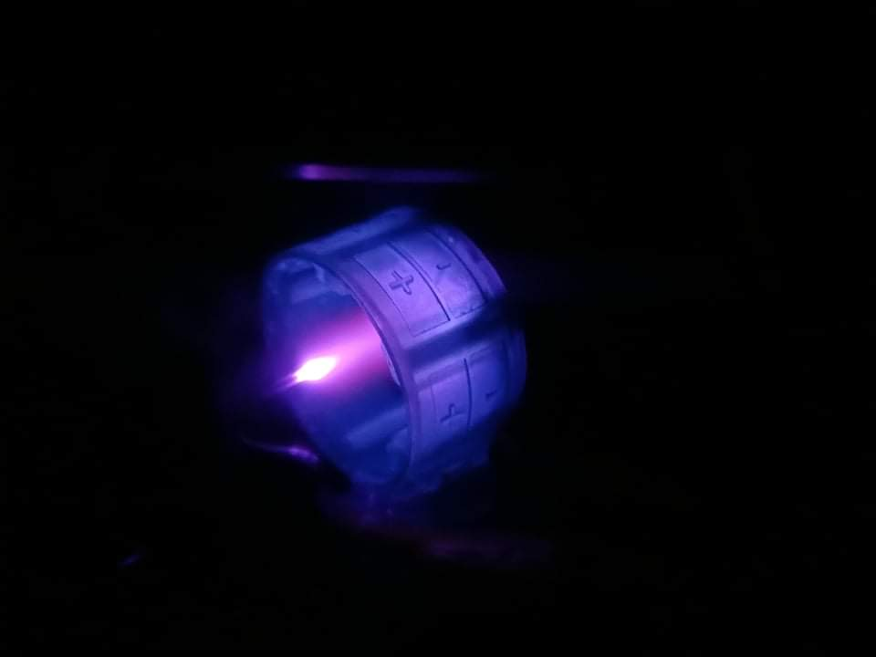
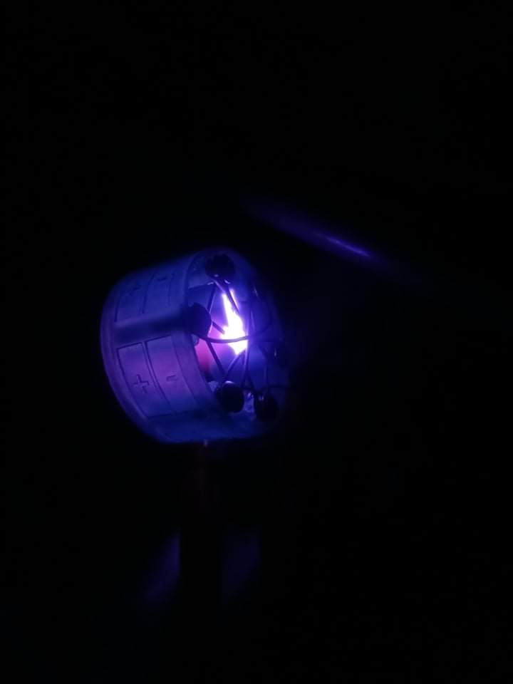
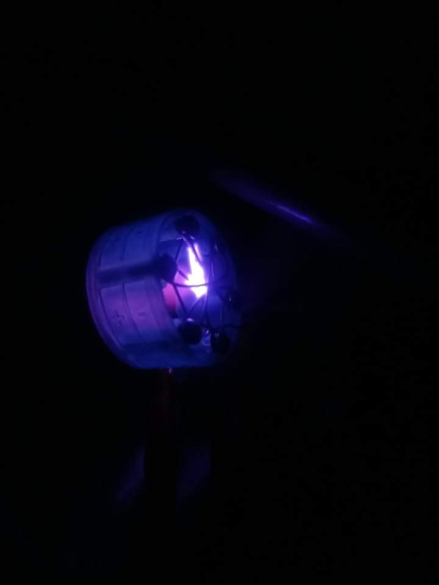
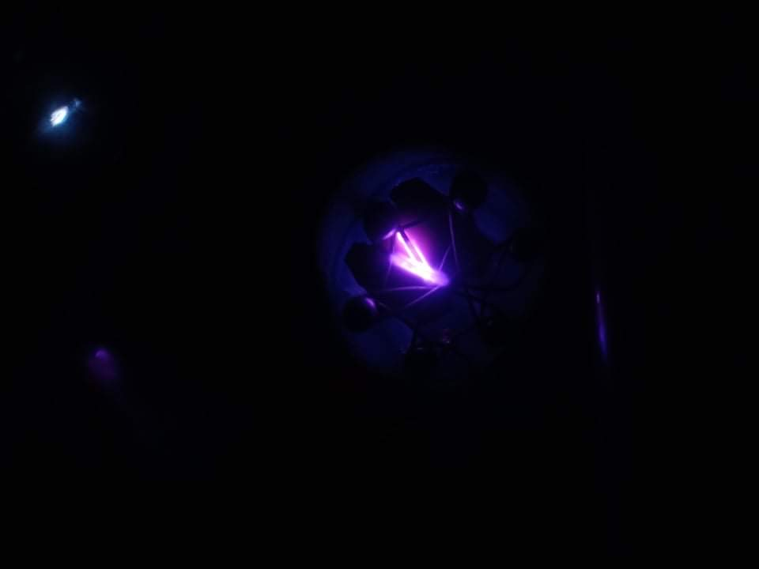
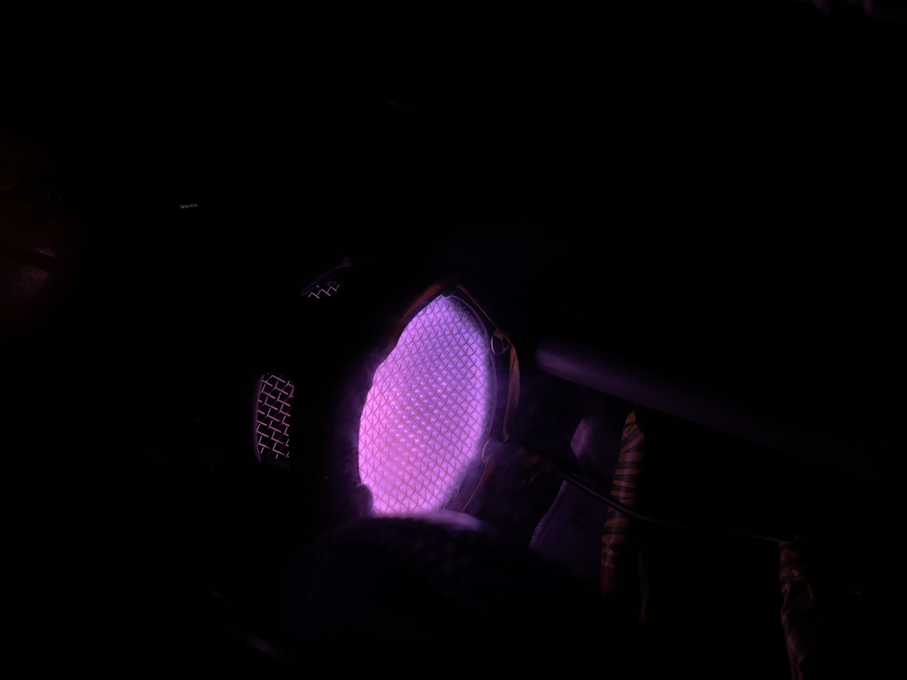

# Farnsworth–Hirsch Fusor

A homemade inertial electrostatic confinement (IEC) plasma device — commonly known as a fusor — built from scratch. The device uses a high-voltage electric field to accelerate ions inward toward a central wire-grid cathode, generating a deuterium plasma and producing the characteristic "star in a jar" glow discharge. This is a demo/plasma fusor (not neutron-producing), built as an introduction to vacuum systems, high-voltage electronics, and plasma physics.

## How It Works

A vacuum chamber is evacuated to low pressure (roughly 1–10 mTorr) using a rotary vane vacuum pump. A high voltage (typically 10–30 kV) is applied between a cylindrical outer anode and an inner wire-grid cathode. Residual gas (air or deuterium) is ionised and the ions are accelerated toward the centre, colliding and forming a glowing plasma. At sufficiently low pressure and high voltage, the ion beams intersect at the geometric centre and produce the "star" pattern — radial beams of concentrated plasma.

## Build Details

- **Vacuum chamber:** Custom-built cylindrical acrylic tube with machined metal endcap flanges and KF-style fittings
- **Inner cathode:** Wire-grid electrode (visible inside the chamber as a small cage)
- **Outer anode:** Cylindrical cage surrounding the inner grid
- **Vacuum pump:** Rotary vane oil pump
- **Power supply:** High-voltage DC supply (~10–30 kV)
- **Pressure measurement:** Thermocouple or Pirani vacuum gauge

---

## Gallery

### Setup & Hardware

| | |
|---|---|
|  |  |
| **Full chamber assembly lit up** — the acrylic cylindrical vacuum vessel showing the inner cathode grid and external electrical feedthroughs. A yellow vacuum pump is visible in the background. | **Chamber through the viewport** — plasma glow visible through the wire mesh viewport window on the side of the chamber. |

### Plasma Operation

| | | |
|---|---|---|
|  |  |  |
| **"Star in a jar" pattern** — the classic IEC fusor plasma mode. Bright radial beams of ions converge at the geometric centre of the cathode grid, forming a star-shaped glow. | **Close-up of the fusor body** — the cylindrical vacuum chamber body illuminated by the intense purple/magenta glow of the plasma discharge. Electrode polarity markings (+/−) are visible on the outer casing. | **Side profile during discharge** — the fusor glowing with full plasma at operating pressure. The blue-purple haze surrounding the chamber is scattered light from the plasma. |

| | | |
|---|---|---|
|  |  |  |
| **Ion beam intersection** — another angle showing the ion beams converging at the centre of the cathode grid. | **Top-down view of plasma** — the star pattern is clearly visible through the outer cathode cage from this angle, showing the spherical symmetry of the ion focusing. | **Viewport close-up** — the inner cathode grid glowing intensely, photographed through the wire mesh viewport window. The lattice of the mesh window is clearly visible. |

---

## Videos

The folder contains video recordings of the fusor during operation. These are best viewed with Git LFS or downloaded directly.

---

## Notes & Lessons Learned

- Achieving a sharp "star" pattern requires careful pressure control — too high and the plasma is diffuse; too low and the discharge extinguishes
- HV safety is critical: the high-voltage feedthrough must be thoroughly insulated and the operator must never touch the chamber during operation
- Oil backstreaming from the rotary pump can contaminate the chamber; a foreline trap is recommended for extended runs
