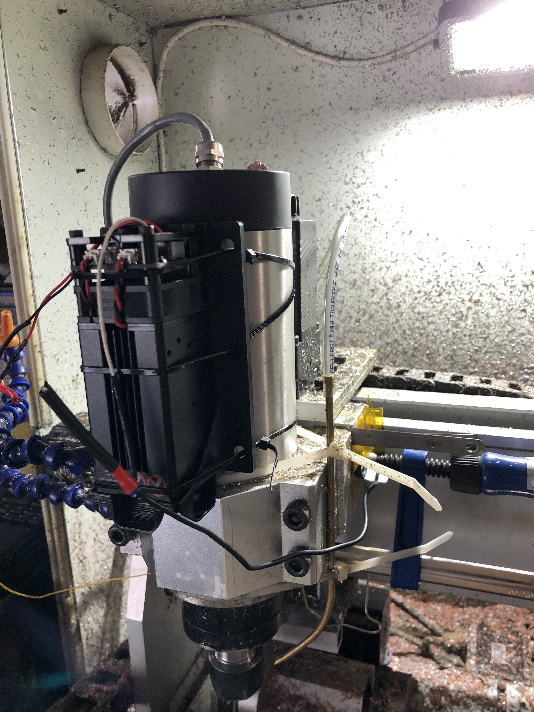
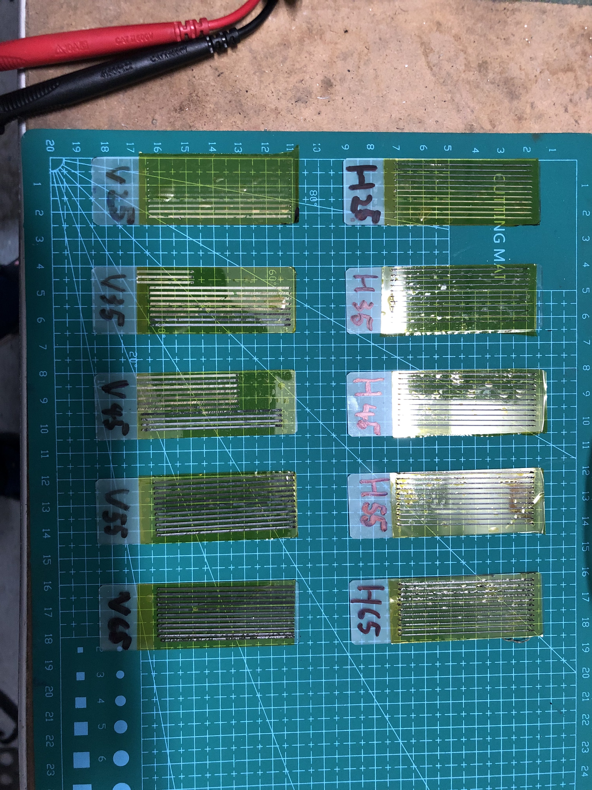
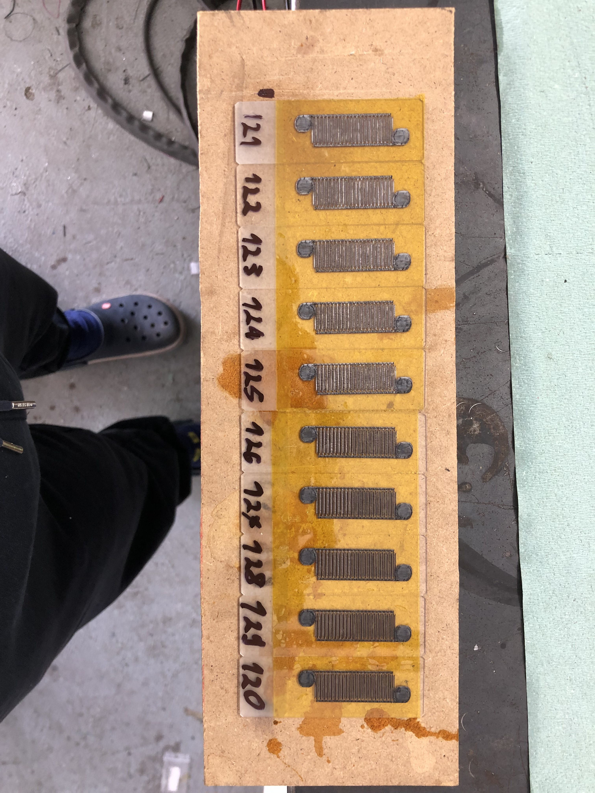
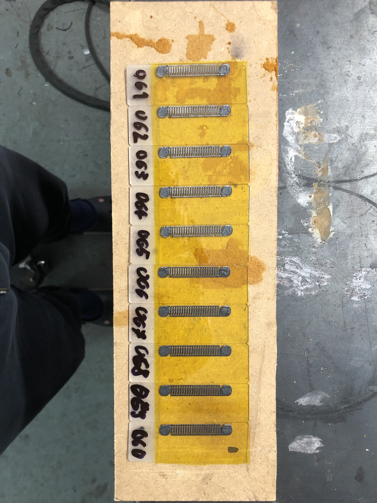
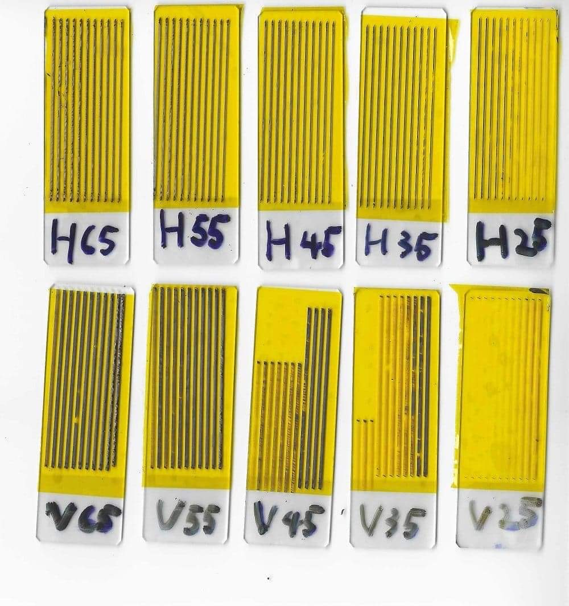
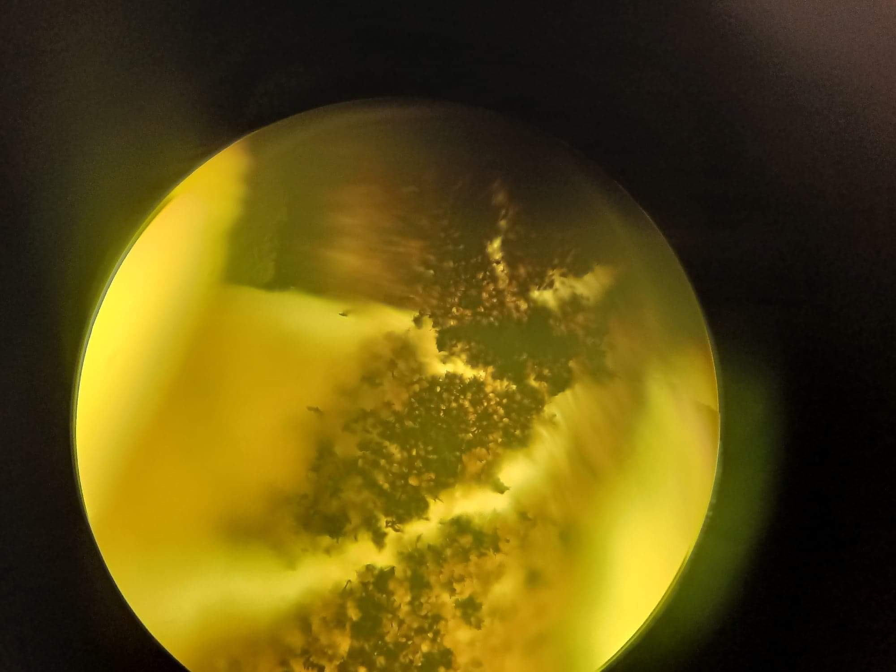

# Graphene Supercapacitor

A research and fabrication project producing laser-scribed graphene oxide (LSGO) supercapacitor electrodes. Graphene oxide (GO) is deposited onto a flexible substrate and then selectively reduced to conductive reduced graphene oxide (rGO) using a laser engraver, creating interdigitated electrode patterns directly without any chemical processing. The resulting electrodes were tested for capacitance under varying fabrication parameters.

## How It Works

Graphite oxide is exfoliated in water to produce a graphene oxide suspension, which is then coated onto a substrate (PET film or tape) and dried. A CO₂ or diode laser engraver then selectively irradiates the GO film — the laser energy reduces the insulating GO to highly conductive rGO in the scanned areas, while the unexposed areas remain insulating. By programming the laser to follow an interdigitated comb pattern, two electrically isolated but interleaved electrodes are formed within a single thin film, creating a micro-supercapacitor cell.

Parameters varied during testing include laser scan orientation (H = horizontal lines, V = vertical lines) and scan spacing (25–65, representing spacing in some unit), allowing systematic optimisation of electrode conductivity and accessible surface area.

## Build Details

- **Electrode material:** Laser-reduced graphene oxide (rGO) from graphene oxide precursor
- **Substrate:** PET film / Kapton tape (yellow/gold coloured)
- **Patterning tool:** CNC laser engraver (diode laser mounted on custom CNC frame — visible in gallery)
- **Electrode geometry:** Interdigitated finger pattern (maximises electrode perimeter for capacitance)
- **Electrolyte:** Aqueous or gel electrolyte applied over the electrode area
- **Parameters tested:** Scan orientation (H/V), scan line spacing (25–65 units)

---

## Gallery

### Electrode Fabrication

| | |
|---|---|
|  |  |
| **Laser engraver / CNC machine** — the diode laser engraver used to pattern the graphene oxide film. The laser head is mounted on a custom-built CNC gantry frame. Test specimens are visible on the work surface to the right. | **First batch of electrode samples** — an array of LSGO interdigitated electrodes laid out on a cutting mat, with a multimeter connected for resistance measurements. Samples are labelled by parameter set (V25, V35, V45, H25, H35, H45, H55, H65…). Green/yellow colour indicates areas of graphene oxide; the darker interdigitated regions are the laser-reduced rGO. |

| | |
|---|---|
|  |  |
| **Numbered sample batch (121–120)** — ten electrodes mounted on a backing board and numbered sequentially. The consistent interdigitated finger pattern is clearly visible across all samples. Slight colour variation between samples reflects differences in GO reduction depth. | **Another parameter sweep batch** — a further set of ten electrodes on a MDF backing board, labelled with scan parameters (050–100 range). These represent a systematic sweep across laser power or speed settings. |

### Characterisation

| | |
|---|---|
|  |  |
| **Finished labelled electrode set** — a neatly organised set of ten completed electrodes labelled H25–H65 and V25–V65, showing the two orientations (horizontal and vertical scan lines) clearly distinguishable by appearance. | **Optical microscope view of rGO surface** — high-magnification view of the laser-scribed graphene surface showing the characteristic dendritic/fractal microstructure of the reduced graphene oxide. The uneven dark regions are clusters of graphene sheets with high surface area. |

---

## Videos

Video recordings in this folder document the laser scribing process and electrode testing.

---

## Results & Notes

- Electrode resistance and capacitance varied significantly with scan line spacing and orientation
- Tighter scan spacing (lower number) generally produced more uniform reduction but lower surface roughness
- The interdigitated geometry eliminates the need for a separator membrane compared to traditional sandwich-type supercapacitor cells
- All processing is solvent-free and carried out at room temperature — no furnace or chemical reduction required
