# M3DP — Metal 3D Printer

A fully custom-built metal 3D printer designed and constructed from scratch, including the mechanical frame, electronics, custom PCB, firmware, and control software. The machine uses an aluminium extrusion frame with a heated enclosure, a custom motor controller board based on Arduino Mega, and a proprietary print head. The project encompasses mechanical design, PCB design and manufacture, embedded firmware development, and CNC fabrication of structural parts.

## How It Works

The printer uses a paste/pellet extrusion or bound-metal deposition approach to deposit metal-loaded material layer by layer. A Z-axis stage lowers the build platform incrementally while the print head traverses the X-Y plane depositing material. After printing, parts undergo sintering in a furnace to burn out the binder and sinter the metal particles into a solid part.

Key subsystems:
- **Frame:** 40×40 mm aluminium extrusion structural frame with linear rails and lead screws
- **Heated enclosure:** Custom sheet-aluminium enclosure on top of the frame to maintain elevated ambient temperature during printing
- **Electronics cabinet:** Industrial IP-rated enclosure (bottom of frame) housing all electronics
- **Control board:** Custom-designed "M3DP PCB" with Arduino Mega, stepper motor drivers (TMC series), relay modules, and I/O terminal blocks
- **User interface:** 7" touchscreen display + 16×2 LCD + physical START/HOME/E-STOP buttons
- **Firmware:** Custom Arduino-based firmware ("hello there!" on boot)

---

## Gallery

### Electronics & PCB

| | |
|---|---|
| 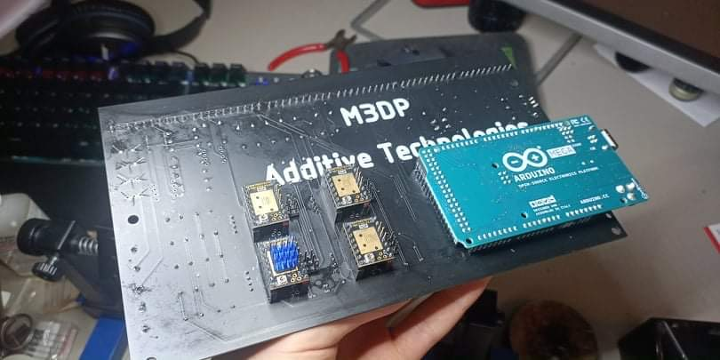 | 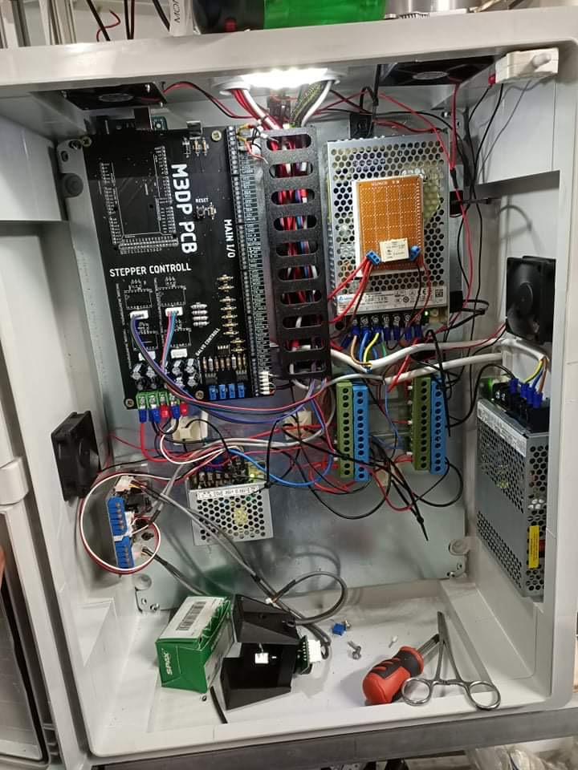 |
| **Custom M3DP PCB** — the hand-held control board labelled "M3DP PCB — Additive Technologies". An Arduino Mega 2560 occupies the right side; four stepper motor driver modules are socketed in the centre; custom PCB traces handle I/O routing, relay switching, and power distribution. | **Electronics cabinet wired up** — the open industrial enclosure with the M3DP PCB mounted at left, two switching power supplies (24V and 12V), DIN rail terminal blocks, and relay modules. All stepper and sensor wiring is routed through the terminal blocks. |

| | |
|---|---|
| 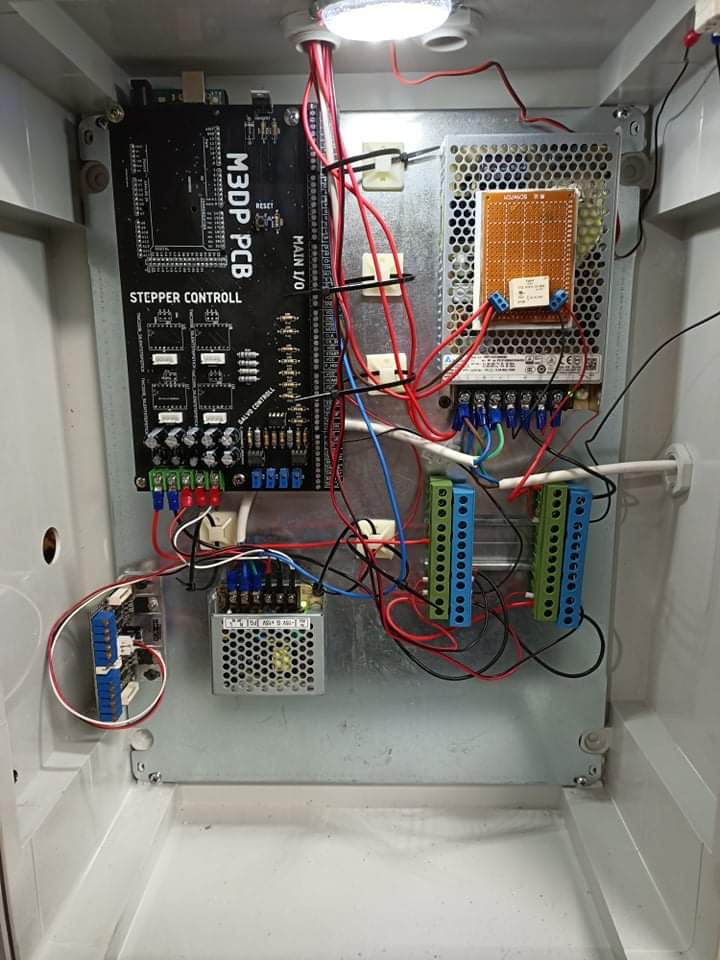 | 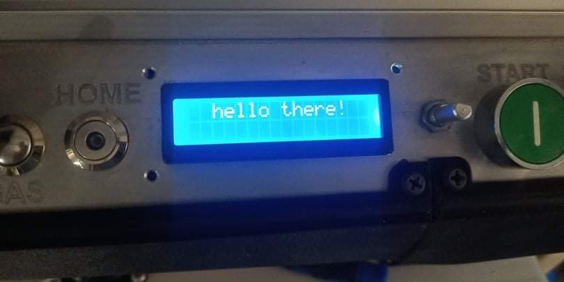 |
| **Electronics cabinet at a later stage** — the cabinet after tidying. The PCB, PSUs, and wiring are more neatly arranged; the power distribution and signal wiring are separated on either side of the panel. | **LCD boot screen** — the 16×2 character display showing the firmware startup message: *"hello there!"* The control panel also shows the HOME button, key switch, and green START button. |

### Mechanical Build

| | |
|---|---|
| 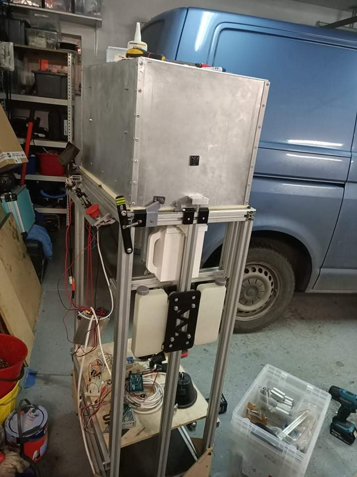 | 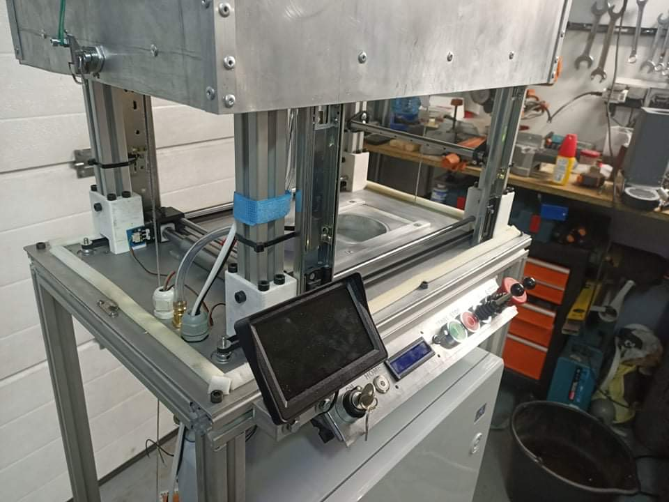 |
| **Early frame assembly** — the aluminium extrusion frame taking shape in the garage. The electronics cabinet enclosure is mounted at the bottom; the Z-axis linear guide column is visible at centre; two cylindrical components (likely extruder barrels or material reservoirs) hang from the upper carriage. | **Frame with build platform** — the printer mid-build showing the print zone: a flat build platform, the Z-axis stage, and the touchscreen + control panel attached to the front cross-member. |

| | |
|---|---|
| 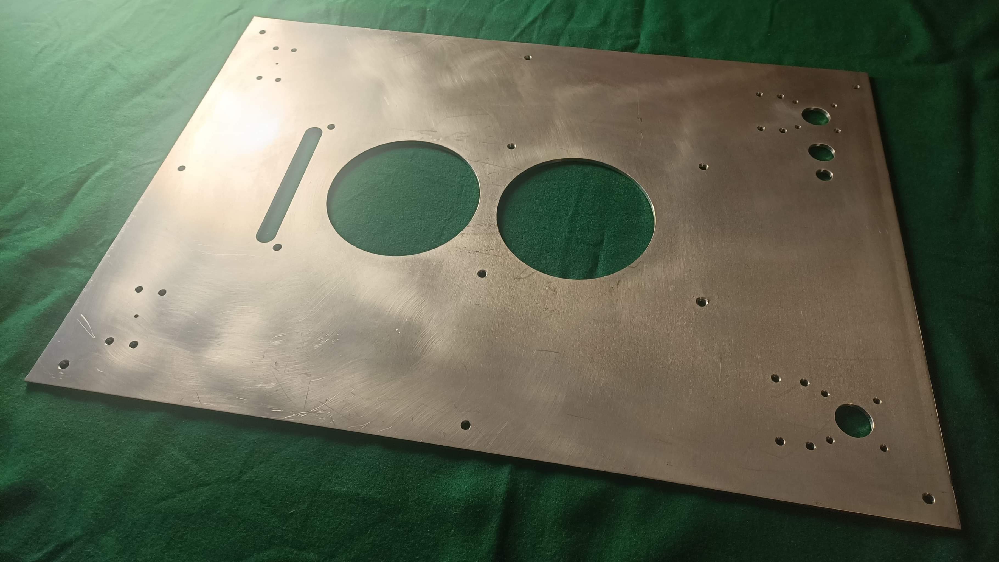 | 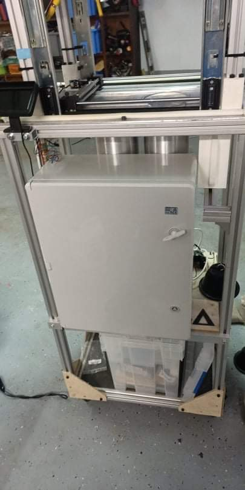 |
| **Machined stainless steel panel** — a precision-cut stainless steel structural panel with two large circular cutouts and multiple mounting holes. This forms part of the print head mounting plate or enclosure. | **Frame nearing completion** — the tall aluminium-frame printer in the workshop, with the sheet-metal enclosure fitted on top. The electronics cabinet (grey IP enclosure) is bolted to the lower frame section. The X/Y gantry rails are visible at the top. |

| | |
|---|---|
| 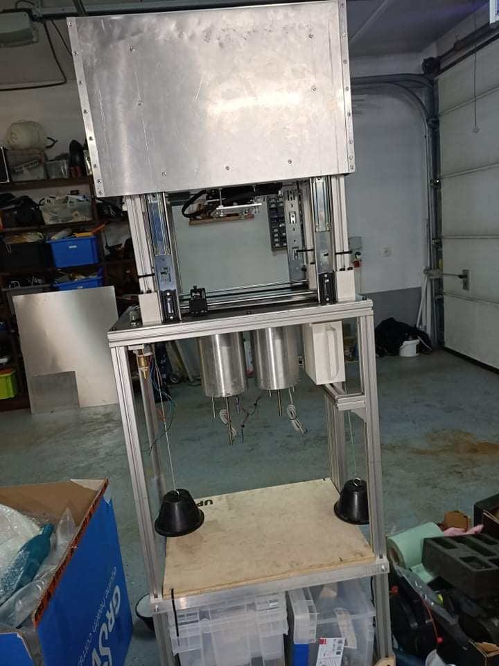 | 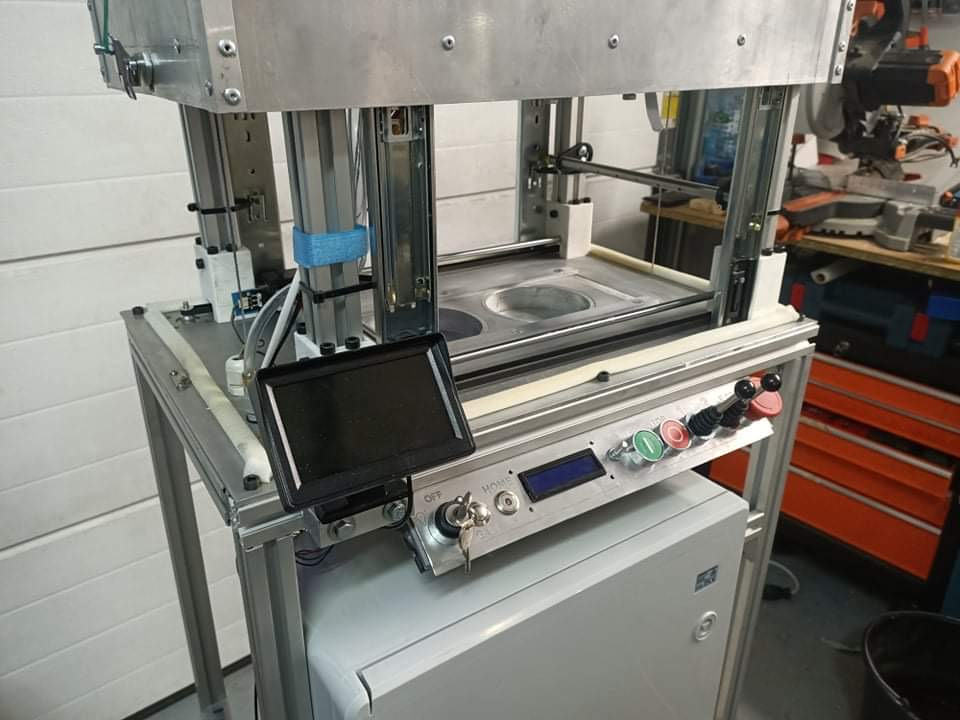 |
| **Printer with dual material reservoirs** — front view of the upper section showing two cylindrical extruder/reservoir barrels hanging from the carriage. The heated enclosure lid is open revealing the print chamber. | **Completed printer — front view** — the machine assembled and in the workshop. The touchscreen, LCD, key switch, green START and red E-STOP buttons are all fitted to the control panel. The print bed is visible through the open enclosure top. |

| |
|---|
| 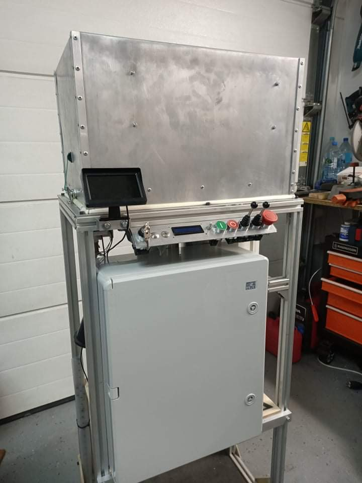 |
| **Completed printer — full view** — the finished machine showing the full height: enclosed print chamber on top, control panel in the middle with touchscreen and buttons, and the electronics cabinet at the bottom, all mounted on the aluminium extrusion frame. |

---

## Videos

The folder contains extensive video recordings documenting motion testing, first prints, and machine calibration runs.

---

## Project Highlights

- Fully custom PCB designed for the project, not an off-the-shelf motion controller
- Custom firmware with boot sequence, homing routines, and print execution
- Industrial-grade wiring practices — terminal blocks, DIN rail, strain relief
- CNC-machined structural metal parts (stainless, aluminium)
- The machine is approximately 1.5 m tall when fully assembled
