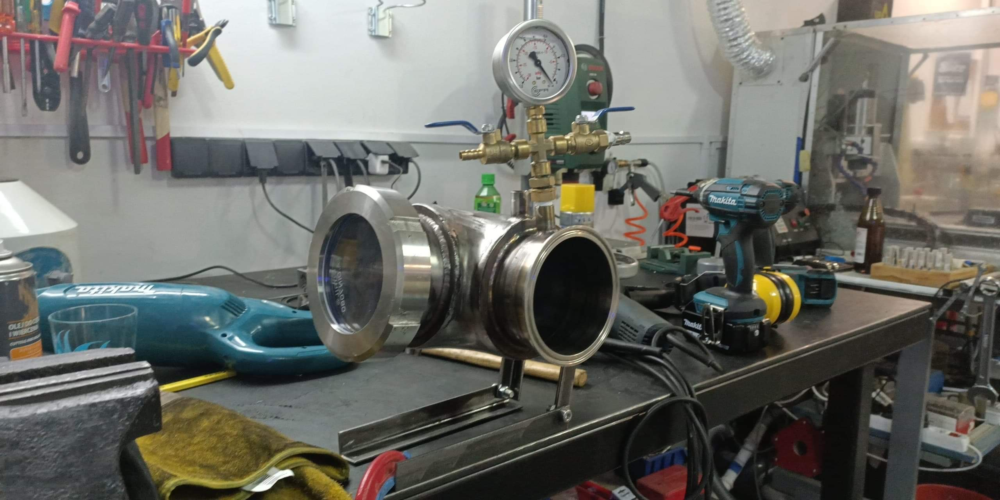
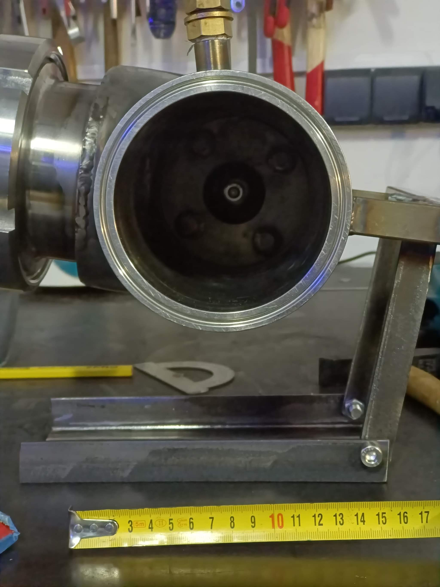
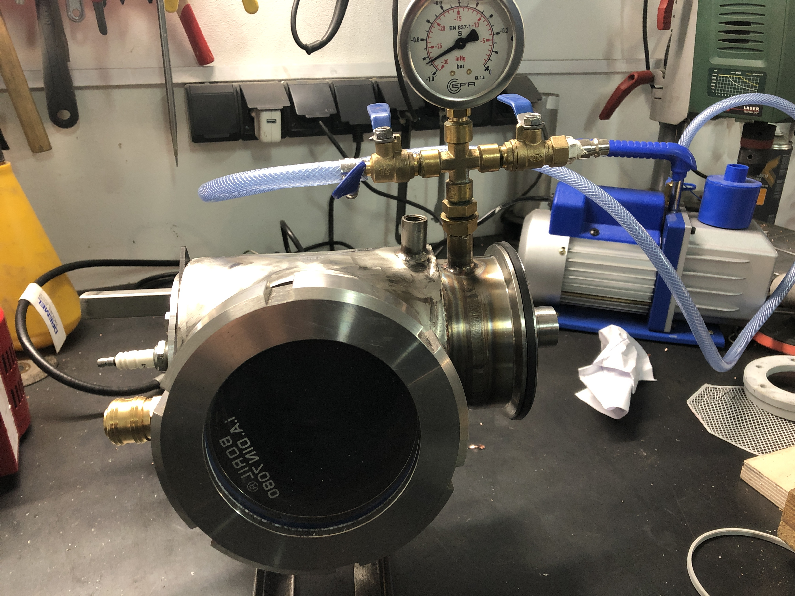
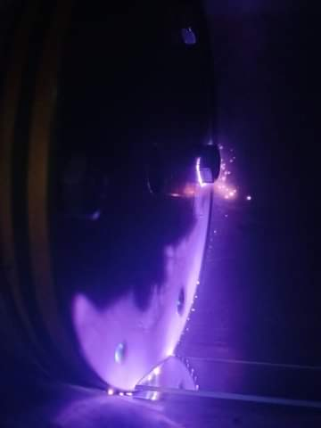
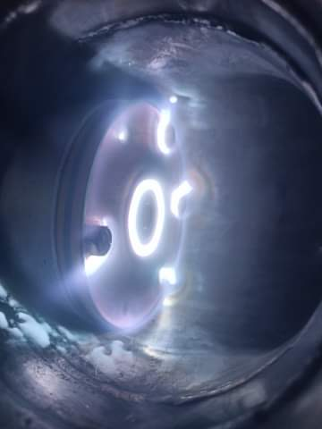
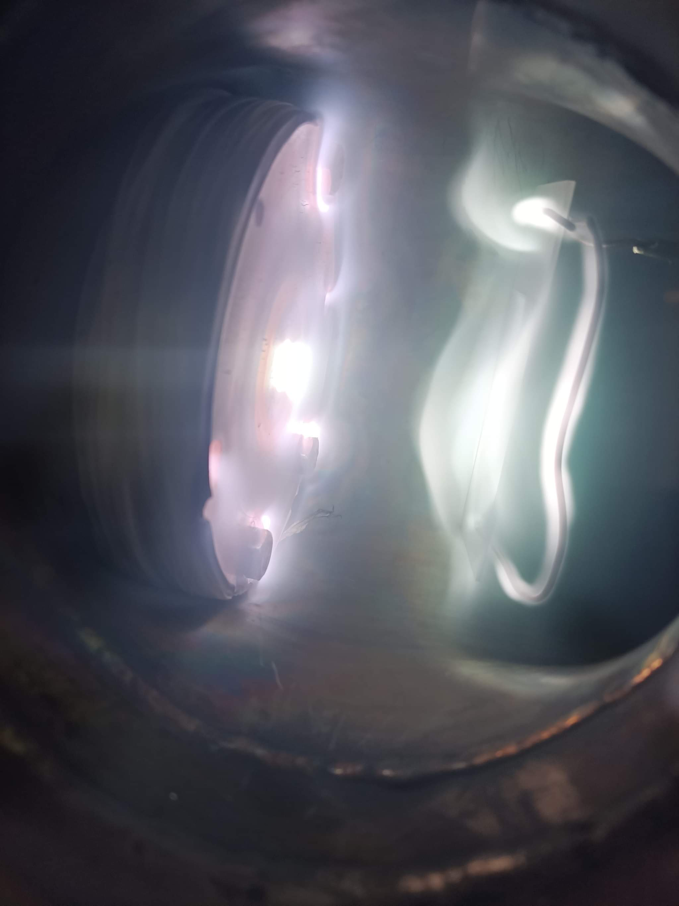

# Physical Vapour Deposition Chamber (PVD)

A homemade vacuum deposition system capable of depositing thin metal films onto substrates via physical vapour deposition. The chamber uses a custom-welded stainless steel vacuum vessel with ISO/KF flanged ports, a rotary vane vacuum pump, and an internal evaporation or sputtering source. Inside the evacuated chamber, a plasma discharge (visible as a bright purple/white glow) is struck at the target material, ejecting atoms that travel through the vacuum and coat the substrate.

## How It Works

The chamber is pumped down to rough vacuum (10⁻² to 10⁻³ mbar range) using a two-stage rotary vane pump. An inert gas (typically argon) is then bled in to a controlled partial pressure and a high-voltage discharge is struck between the anode and cathode. In sputtering mode, positively charged argon ions bombard the metal target (cathode), knocking metal atoms off the surface. These atoms deposit on a substrate mounted opposite the target. A viewport window on the chamber allows direct observation of the plasma and deposition process.

## Build Details

- **Chamber body:** Custom-fabricated stainless steel vacuum vessel with ISO-KF flanged ports
- **Vacuum pump:** Two-stage rotary vane pump (blue pump body visible in photos)
- **Pressure gauge:** Analogue Bourdon tube gauge plus digital transducer
- **Ports:** Multiple KF16/KF25 ports for pump inlet, gas inlet, electrical feedthroughs, and viewport
- **Viewport:** Borosilicate glass viewport for observation
- **Power supply:** High-voltage DC supply for plasma discharge
- **Target material:** Metal targets (copper, aluminium, etc.)

---

## Gallery

### Chamber Assembly

| | |
|---|---|
|  |  |
| **Chamber on workbench** — the assembled PVD chamber with all flanges fitted. A Bourdon pressure gauge and ball valve are visible on top, and the KF-flanged viewport port is open at the front. The chamber sits on a simple steel stand. | **Front port view** — looking directly into the main chamber port with the flange removed. The internal target/cathode holder is visible centred in the bore, with the electrical feedthrough entering from the side. |

| |
|---|
|  |
| **Full system assembled** — the chamber with the rotary vane vacuum pump (blue) connected via flexible hose, gas inlet valves, and pressure gauge manifold. The system is ready for pump-down. |

### Plasma Operation

| | | |
|---|---|---|
|  |  |  |
| **Plasma ignition** — looking through the viewport during plasma strike. The initial high-voltage arc is visible as a bright point of light at the target surface, surrounded by a diffuse purple argon glow discharge. | **Plasma ring** — at stable operating pressure, the glow discharge forms a characteristic bright ring (the cathode dark space boundary) around the target. The plasma fills the entire chamber with a blue-purple glow. | **High-intensity arc discharge** — a bright arc discharge between the target and anode during a high-power deposition run. The plasma is extremely bright at the target surface and casts light throughout the chamber. |

---

## Videos

Numerous video recordings of the chamber pump-down sequence and plasma operation are included in this folder.

---

## Notes & Lessons Learned

- Achieving a stable glow discharge requires carefully balancing gas pressure and applied voltage — the operating window is narrow
- KF flange O-ring condition is critical; even a small nick in the O-ring will prevent reaching deposition-quality vacuum
- The viewport accumulates a thin metal film over time and must be cleaned between runs or replaced
- The rotary pump oil should be checked and changed regularly, as metal vapour can contaminate it
