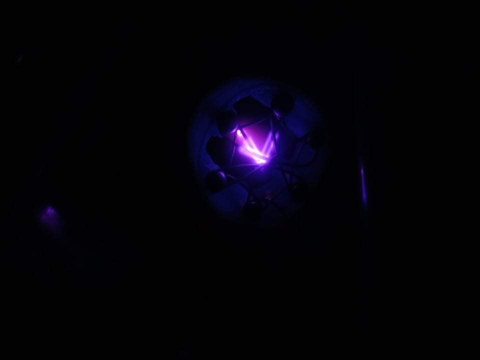

# Teenage Engineering Projects

A collection of ambitious DIY engineering projects built during my teenage years, spanning plasma physics, high-power optics, vacuum science, electrochemistry, and additive manufacturing. Each project was designed, fabricated, and tested from scratch — no kits.

---

## Projects

### [Fusor](./Fusor/)
A Farnsworth–Hirsch inertial electrostatic confinement (IEC) plasma device — the classic "star in a jar". A custom vacuum chamber is pumped to low pressure and a high-voltage discharge accelerates ions inward to form a glowing plasma. Involves vacuum systems, HV electronics, and plasma physics.



---

### [120W Blue Diode Laser Array](./120W%20Blue%20diode%20laser%20array/)
A 120W combined-beam blue (445 nm) laser built from multiple diode bars on a custom water-cooled copper heatsink. All mounting hardware was CNC machined. The beam is powerful enough to cut wood and engrave metal.


---

### [DIY Gas Torch](./DIY%20gas%20torch/)
A homemade high-output gas torch with a custom nozzle, producing a wide, forceful flame suitable for metalworking — brazing, annealing, and heat treatment.


---

### [Graphene Supercapacitor](./Graphene%20supercapacitor/)
Research project producing laser-scribed graphene oxide (LSGO) supercapacitor electrodes. Graphene oxide film is deposited on a flexible substrate and patterned with a laser engraver to create interdigitated rGO electrodes. Multiple parameter sweeps were run to optimise electrode performance.


---

### [M3DP — Metal 3D Printer](./M3DP/)
A fully custom metal 3D printer built from scratch: aluminium extrusion frame, custom PCB (Arduino Mega + stepper drivers), industrial electronics cabinet, heated enclosure, touchscreen interface, and CNC-machined structural parts. One of the largest and most complex projects in this collection.


---

### [Physical Vapour Deposition Chamber (PVD)](./Physical%20vapour%20deposition%20chamber%20%28PVD%29/)
A DIY vacuum thin-film deposition system with a custom-fabricated stainless steel chamber, KF-flanged ports, viewport, and rotary vane vacuum pump. Used to deposit metal films via plasma sputtering. The plasma discharge inside the chamber produces a spectacular blue-purple glow.


---

## Repository Structure

```
Engineering projects/
├── README.md                              ← You are here
├── Fusor/
│   ├── README.md
│   └── *.JPG / *.jpg / *.MOV
├── 120W Blue diode laser array/
│   ├── README.md
│   └── *.JPG / *.jpg / *.MOV
├── DIY gas torch/
│   ├── README.md
│   └── *.JPG / *.MOV
├── Graphene supercapacitor/
│   ├── README.md
│   └── *.JPG / *.jpg / *.MOV
├── M3DP/
│   ├── README.md
│   └── *.JPG / *.jpg / *.PNG / *.MOV
└── Physical vapour deposition chamber (PVD)/
    ├── README.md
    └── *.JPG / *.jpg / *.MOV
```

## Notes on Media Files

- All photos are provided as `.JPG` / `.jpg` / `.PNG` files and render inline on GitHub.
- Original `.HEIC` files (iPhone format) are also present alongside the converted JPGs.
- Video files (`.MOV`) are large and are tracked via **Git LFS** (see `.gitattributes`). You will need Git LFS installed to clone/download them: `git lfs install && git lfs pull`.
